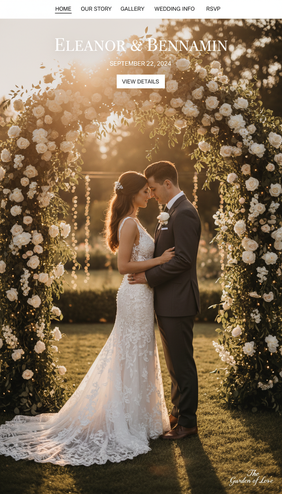
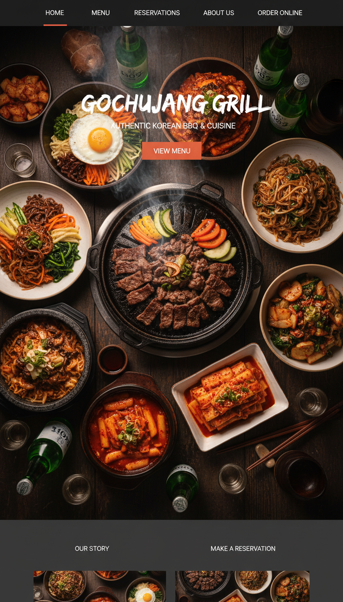

<div align="center">

# 🎨 Image Generator MCP Server

### The missing piece of vibe coding — **AI can generate your code, now it generates your images too.**

[](https://www.npmjs.com/package/@trucopilot/image-generator-vibe-coding)
[](LICENSE)
[](https://modelcontextprotocol.io)
[](https://openrouter.ai)
[](https://runware.ai)

Works with **Claude Code** · **Cursor** · **Windsurf** · **any MCP client**

<br/>

<table>
<tr>
<td align="center" width="50%">



<sub><b>Wedding Website</b> — hero section, navigation, gallery<br/>Generated in ~10 seconds with one prompt</sub>

</td>
<td align="center" width="50%">



<sub><b>Korean Restaurant Website</b> — food photography, menu layout<br/>Generated in ~10 seconds with one prompt</sub>

</td>
</tr>
</table>

<br/>

**Every image above was generated by this MCP server.** No stock photos. No Photoshop. No Midjourney tab-switching.<br/>
Just vibe code your site and the images appear alongside your HTML & CSS.

<br/>

[Quick Install](#-quick-install) · [Why This Matters](#-why-this-exists) · [Models](#-models) · [Tools](#-tools) · [Examples](#-examples) · [trucopilot.com](https://trucopilot.com)

</div>

---

## 🚀 Why This Exists — The Missing Piece of Vibe Coding

**Vibe coding changed everything — except images.**

Claude Code, Cursor, Windsurf — they can scaffold an entire website in minutes. Pixel-perfect layouts, responsive grids, beautiful typography, dark mode, animations. But open the result in a browser and what do you see?

> Grey placeholder boxes. Broken `` tags. Empty hero sections. Skeleton UIs with no soul.

The code is there. The CSS is flawless. But the **visual identity is completely missing** — because AI coding tools generate text and code, not images. You're forced to stop your flow, open Midjourney or DALL-E in another tab, generate images separately, download them, rename them, drag them into your project, update the paths... The magic of vibe coding **dies the moment you need a picture.**

### 🔌 This MCP server fixes that — permanently.

Install it once, and your AI coding assistant can now **generate ultra-realistic 2K images inline** — right alongside the HTML and CSS it's already writing. Hero banners, food photography, product shots, team portraits, background textures — all created in real-time, auto-saved to your project, and referenced in your code. Zero context switching. Zero placeholder images.

### ✨ Before vs. After:

| Without Image Generator | With Image Generator |
|:---|:---|
| ❌ Hero sections with `placeholder.jpg` | ✅ Stunning AI-generated banners that match your brand |
| ❌ Feature cards with broken image icons | ✅ Custom illustrations generated per feature |
| ❌ "Add your image here" TODO comments | ✅ Real images, auto-saved, auto-referenced in code |
| ❌ Static, lifeless mockups you're embarrassed to demo | ✅ Production-ready pages with full visual design |
| ❌ Stop coding → open Midjourney → download → rename → drag | ✅ Images generated inline — zero context switching |

### 🎯 Every page element, covered:

- **🖥️ Hero Sections** — Full-width 16:9 cinematic banners with dramatic lighting and atmosphere
- **🃏 Cards & Features** — 1:1 or 4:3 custom illustrations that bring product features to life
- **👤 Avatars & Profiles** — Ultra-realistic or stylized portraits, any style
- **📱 Mobile Screens** — 9:16 splash screens, onboarding flows, story-format content
- **🍽️ Product & Food Photography** — Restaurant menus, e-commerce catalogs, editorial spreads
- **🌄 Backgrounds & Textures** — Subtle atmospheric images that complete the design
- **🏢 About & Team Pages** — Professional environments, company culture imagery

### 💡 The bottom line:

Your vibe-coded website goes from **"skeleton with grey boxes"** to **"fully designed with real visuals"** — in a single AI session, without ever leaving your editor.

> *Every image in this README — the wedding site, the Korean restaurant, the cherry blossom banner — was generated by this MCP in under 10 seconds each.*

<p align="center"></p>

---

## ⚡ Quick Install

Set **at least one** API key. Provider priority when auto-detecting: **OpenRouter → Runware → Gemini**.

### OpenRouter (default)

```bash
claude mcp add --scope user image-generator \
  -e OPENROUTER_API_KEY=YOUR_OPENROUTER_API_KEY \
  -- npx -y @trucopilot/image-generator-vibe-coding
```

> 🔑 Get your key at [openrouter.ai/keys](https://openrouter.ai/keys)

### Runware (diffusion models, cost-efficient)

```bash
claude mcp add --scope user image-generator \
  -e RUNWARE_API_KEY=YOUR_RUNWARE_API_KEY \
  -- npx -y @trucopilot/image-generator-vibe-coding
```

> 🔑 Get your key at [runware.ai](https://runware.ai) — then pass `provider: "runware"` on each tool call (or set Runware as your only key for auto-detection)

### Gemini (direct API)

```bash
claude mcp add --scope user image-generator \
  -e GEMINI_API_KEY=YOUR_GEMINI_API_KEY \
  -- npx -y @trucopilot/image-generator-vibe-coding
```

> 🔑 Get your key at [aistudio.google.com/apikey](https://aistudio.google.com/apikey)

<details>
<summary>📁 Project scope only (click to expand)</summary>

```bash
# OpenRouter
claude mcp add image-generator \
  -e OPENROUTER_API_KEY=YOUR_OPENROUTER_API_KEY \
  -- npx -y @trucopilot/image-generator-vibe-coding

# Runware
claude mcp add image-generator \
  -e RUNWARE_API_KEY=YOUR_RUNWARE_API_KEY \
  -- npx -y @trucopilot/image-generator-vibe-coding
```

</details>

<details>
<summary>⚙️ Manual JSON config — Claude Code, Cursor, Windsurf, etc. (click to expand)</summary>

**OpenRouter:**

```json
{
  "mcpServers": {
    "image-generator": {
      "command": "npx",
      "args": ["-y", "@trucopilot/image-generator-vibe-coding"],
      "env": {
        "OPENROUTER_API_KEY": "your-openrouter-key-here"
      }
    }
  }
}
```

**Runware:**

```json
{
  "mcpServers": {
    "image-generator": {
      "command": "npx",
      "args": ["-y", "@trucopilot/image-generator-vibe-coding"],
      "env": {
        "RUNWARE_API_KEY": "your-runware-key-here"
      }
    }
  }
}
```

**Multiple providers** (set all keys you have — OpenRouter is preferred when multiple are present):

```json
{
  "mcpServers": {
    "image-generator": {
      "command": "npx",
      "args": ["-y", "@trucopilot/image-generator-vibe-coding"],
      "env": {
        "OPENROUTER_API_KEY": "your-openrouter-key-here",
        "RUNWARE_API_KEY": "your-runware-key-here",
        "GEMINI_API_KEY": "your-gemini-key-here"
      }
    }
  }
}
```

**Cursor** — add the JSON above to `.cursor/mcp.json` (project) or **Cursor Settings → MCP** (global).

**Local development** (run from this repo instead of npm):

```json
{
  "mcpServers": {
    "image-generator": {
      "command": "node",
      "args": ["/absolute/path/to/image-mcp/dist/index.js"],
      "env": {
        "RUNWARE_API_KEY": "your-runware-key-here"
      }
    }
  }
}
```

</details>

---

## 🤖 Vibe Coding Prompt — Copy & Paste

Drop this prompt into **Claude Code** (or any AI coding tool). Replace the **two placeholders** and it will auto-configure everything — MCP install, CLAUDE.md rules, persistent memory.

> 💡 This is the recommended way to set up image generation in your vibe coding workflow.

<pre>
Fetch this doc: https://github.com/TruCopilot/image-generator-vibe-coding and install the
image-generator MCP server for me. Use user scope if possible, otherwise project scope.

Install command (pick your provider):
claude mcp add --scope user image-generator \
  -e OPENROUTER_API_KEY=<b>[YourOpenRouterAPIKey]</b> \
  -- npx -y @trucopilot/image-generator-vibe-coding

# OR for Runware:
claude mcp add --scope user image-generator \
  -e RUNWARE_API_KEY=<b>[YourRunwareAPIKey]</b> \
  -- npx -y @trucopilot/image-generator-vibe-coding

Then update my CLAUDE.md (or AGENTS.md) and your memory with these image generation rules:

# Image Generation (MANDATORY for all visual content)

- MCP Server: `image-generator` (via @trucopilot/image-generator-vibe-coding)
- Provider: `<b>[YourProvider]</b>` — `openrouter` · `runware` · `gemini`
- Model: `<b>[YourModelName]</b>`
  - OpenRouter: `google/gemini-2.5-flash-image` (fast) or `google/gemini-3-pro-image-preview` (quality)
  - Runware: `runware:400@6` (default, cheapest) · `runware:101@1` (FLUX, img2img) · any Runware model ID
  - Gemini direct: `gemini-2.5-flash-image` (fast) or `gemini-3-pro-image-preview` (quality)

## Rules
- ALWAYS use the `image-generator` MCP to generate images when working on new designs,
  building UI, or making the site more beautiful — hero sections, banners, cards,
  backgrounds, avatars, and any visual content
- CRITICAL: Always call via sub-agent (Agent tool) — base64 image data will crash
  the main context window if returned directly
- Resolution:
  - Runware: default `1K` (1024px, cheapest). Use `2K` for hero banners. Only use `4K` if I ask.
  - OpenRouter/Gemini: default `2K`
- Style: Ultra-realistic, high detail, professional photography quality — include
  lighting, composition, and mood descriptors in every prompt
- Runware: use `negativePrompt` for quality control (e.g. "blurry, watermark, extra fingers")
- Aspect ratios — choose based on design context:
  - `1:1`  → Avatars, profile pics, square cards, thumbnails
  - `16:9` → Hero banners, page headers, blog covers, landscape backgrounds
  - `9:16` → Mobile splash screens, story formats, vertical banners
  - `3:4` / `4:3` → Product cards, feature sections
  - `2:3` / `3:2` → Portrait/landscape editorial layouts
- Output directory: `./public/images/generated/` (or project-appropriate path)
- After generating, use the saved file path in &lt;img&gt; or CSS background-image
  — never embed base64 in markup

## Sub-Agent Pattern (Required)
Always generate images through a sub-agent like this:
  Agent tool → "Use the image-generator MCP generate_image tool with:
    provider: '[YourProvider]',
    prompt: '&lt;detailed visual description&gt;',
    model: '[YourModelName]',
    aspectRatio: '&lt;pick based on context&gt;',
    imageSize: '&lt;1K for Runware default, 2K for OpenRouter&gt;',
    outputDir: './public/images/generated/'
  Report back ONLY the saved file path, do NOT return image data."

Save this to your persistent memory so every future session uses these rules automatically.
</pre>

**Replace before pasting:**

| Placeholder | Replace with | Example |
|:---|:---|:---|
| `[YourOpenRouterAPIKey]` | Your OpenRouter API key | `sk-or-v1-abc123...` |
| `[YourRunwareAPIKey]` | Your Runware API key | From [runware.ai](https://runware.ai) dashboard |
| `[YourProvider]` | Provider to use | `runware` · `openrouter` · `gemini` |
| `[YourModelName]` | Full model ID from your provider | Runware: `runware:400@6` · OpenRouter: `google/gemini-2.5-flash-image` |

---

## 🔌 Providers

<table>
<tr>
<td align="center" width="33%">

### ☁️ OpenRouter <sup>default</sup>

**300+ models** via one API<br/>
OpenAI-compatible<br/>

`OPENROUTER_API_KEY`

[Get your key →](https://openrouter.ai/keys)

</td>
<td align="center" width="33%">

### 🟢 Runware

**400K+ diffusion models**<br/>
FLUX · SDXL · SD 1.5 · Civitai<br/>

`RUNWARE_API_KEY`

[Get your key →](https://runware.ai)

</td>
<td align="center" width="33%">

### 🔷 Google Gemini

Direct Gemini API access<br/>
Native image generation<br/>

`GEMINI_API_KEY`

[Get your key →](https://aistudio.google.com/apikey)

</td>
</tr>
</table>

> Provider is auto-detected from available env vars: **OpenRouter → Runware → Gemini**. Override per-request with `provider: "openrouter"` · `"runware"` · `"gemini"`.

---

## 🧠 Models

### OpenRouter / Gemini

| Model | OpenRouter ID | Gemini ID | Best For |
|:---|:---|:---|:---|
| ⚡ **Flash** | `google/gemini-2.5-flash-image` | `gemini-2.5-flash-image` | Fast, high-volume generation |
| 💎 **Pro** | `google/gemini-3-pro-image-preview` | `gemini-3-pro-image-preview` | Maximum quality output |

> 🔍 **[Browse 300+ image models on OpenRouter →](https://openrouter.ai/models?fmt=cards&input_modalities=text&output_modalities=image)**

### Runware

| Model | ID | Best For |
|:---|:---|:---|
| ⚡ **Default** | `runware:400@6` | Text-to-image, cost-efficient (~$0.004/image at 1K) |
| 🎨 **FLUX Dev** | `runware:101@1` | Image-to-image editing, style transfer |
| 🔧 **Custom** | Any Runware model ID | e.g. `civitai:101055@128078`, `runware:101@1` |

> 🔍 **[Browse 400K+ models on Runware →](https://runware.ai/models)** — pass any model ID in the `model` parameter with `provider: "runware"`.
>
> **Note:** `runware:400@6` is text-to-image only. For `edit_image`, the server auto-falls back to `runware:101@1` (FLUX) when the default model is used.

---

## 🛠 Tools

### 🖼️ `generate_image`

Generate an image from a text prompt.

| Parameter | Type | Default | Description |
|:---|:---|:---|:---|
| `prompt` | `string` | *(required)* | Text description of the image |
| `model` | `string` | `google/gemini-2.5-flash-image` | Model ID — see [Models](#-models). Runware defaults to `runware:400@6` when a Gemini model name is passed |
| `aspectRatio` | `enum` | `1:1` | `1:1` · `16:9` · `9:16` · `3:4` · `4:3` · `2:3` · `3:2` · `4:5` · `5:4` · `21:9` |
| `imageSize` | `enum` | `2K` / `1K`* | `0.5K` · `1K` · `2K` · `4K` — *Runware defaults to `1K` |
| `outputDir` | `string` | `./generated-images` | Directory to save generated images |
| `provider` | `enum` | auto-detect | `openrouter` · `runware` · `gemini` |
| `negativePrompt` | `string` | — | **Runware only** — what to avoid (e.g. `blurry, watermark, extra fingers`) |
| `steps` | `number` | `30` | **Runware only** — denoising steps |
| `cfgScale` | `number` | — | **Runware only** — CFG scale for prompt adherence |

### ✏️ `edit_image`

Edit an existing image with text instructions.

| Parameter | Type | Default | Description |
|:---|:---|:---|:---|
| `prompt` | `string` | *(required)* | Edit instructions |
| `imagePath` | `string` | *(required)* | Path to source image |
| `model` | `string` | `google/gemini-2.5-flash-image` | Model ID — Runware img2img: use `runware:101@1` or let server auto-fallback from `runware:400@6` |
| `aspectRatio` | `enum` | *(optional)* | Output aspect ratio |
| `imageSize` | `enum` | `1K`* | **Runware only** — resolution tier |
| `outputDir` | `string` | `./generated-images` | Directory to save edited images |
| `provider` | `enum` | auto-detect | `openrouter` · `runware` · `gemini` |
| `negativePrompt` | `string` | — | **Runware only** |
| `steps` | `number` | `30` | **Runware only** |
| `cfgScale` | `number` | — | **Runware only** |
| `strength` | `number` | `0.85` | **Runware only** — img2img strength (0 = preserve, 1 = full transform) |

---

## 📐 Aspect Ratio Guide

### OpenRouter / Gemini

| Ratio | Resolution (2K) | Best For |
|:---|:---|:---|
| `1:1` | 1024×1024 | Avatars, profile pics, square cards, thumbnails |
| `16:9` | 1344×768 | Hero banners, page headers, blog covers, landscape BGs |
| `9:16` | 768×1344 | Mobile splash, stories, vertical banners, wallpapers |
| `3:4` / `4:3` | 864×1184 | Product cards, feature sections, content blocks |
| `2:3` / `3:2` | 832×1248 | Portrait/landscape editorial, magazine layouts |
| `4:5` / `5:4` | 896×1152 | Social media posts, Instagram |
| `21:9` | 1536×672 | Ultra-wide banners, cinematic headers |

### Runware

Runware dimensions are computed from aspect ratio + size tier. All values are **multiples of 64**. Max dimension is **2048** unless `4K` is explicitly requested.

| Ratio | 1K (default) | 2K | Best For |
|:---|:---|:---|:---|
| `1:1` | 1024×1024 | 2048×2048 | Avatars, cards, thumbnails |
| `16:9` | 1024×576 | 2048×1152 | Hero banners, cinematic headers |
| `9:16` | 576×1024 | 1152×2048 | Mobile splash, stories |
| `3:4` / `4:3` | 768×1024 / 1024×768 | 1536×2048 / 2048×1536 | Product cards, features |
| `21:9` | 1024×448 | 2048×896 | Ultra-wide banners |

---

## 💬 Examples

Once configured, just ask your AI assistant:

```
"Generate a hero image of a futuristic cityscape at night, neon lights, rain reflections"
```
```
"Create a 16:9 banner for my blog post about machine learning"
```
```
"Edit this image to add dramatic clouds and golden hour lighting"
```
```
"Generate a 1:1 avatar of a friendly robot mascot, 3D rendered, studio lighting"
```

**Runware-specific** (mention provider or set `RUNWARE_API_KEY` as your only key):

```
"Generate a product photo using Runware — a ceramic coffee mug on marble, studio lighting, provider runware, 1K"
```
```
"Create a 16:9 hero banner with Runware at 2K — mountain landscape at golden hour, negative prompt blurry watermark"
```
```
"Edit ./public/images/hero.png to watercolor style using Runware"
```

---

## 🔧 Development

```bash
git clone https://github.com/TruCopilot/image-generator-vibe-coding.git
cd image-generator-vibe-coding
npm install
cp .env.example .env   # add your API key(s)
npm run build
```

Test the MCP server locally:

```bash
# OpenRouter
OPENROUTER_API_KEY=your-key node dist/index.js

# Runware
RUNWARE_API_KEY=your-key node dist/index.js
```

Run the Runware integration test suite:

```bash
RUNWARE_API_KEY=your-key node scripts/test-runware.mjs
```

This validates dimension math, text-to-image, negative prompts, image-to-image, and server startup.

---

<div align="center">

**Built with ❤️ by [TruCopilot](https://trucopilot.com)**

[GitHub](https://github.com/TruCopilot/image-generator-vibe-coding) · [npm](https://www.npmjs.com/package/@trucopilot/image-generator-vibe-coding) · [OpenRouter](https://openrouter.ai) · [Runware](https://runware.ai) · [MIT License](LICENSE)

</div>
